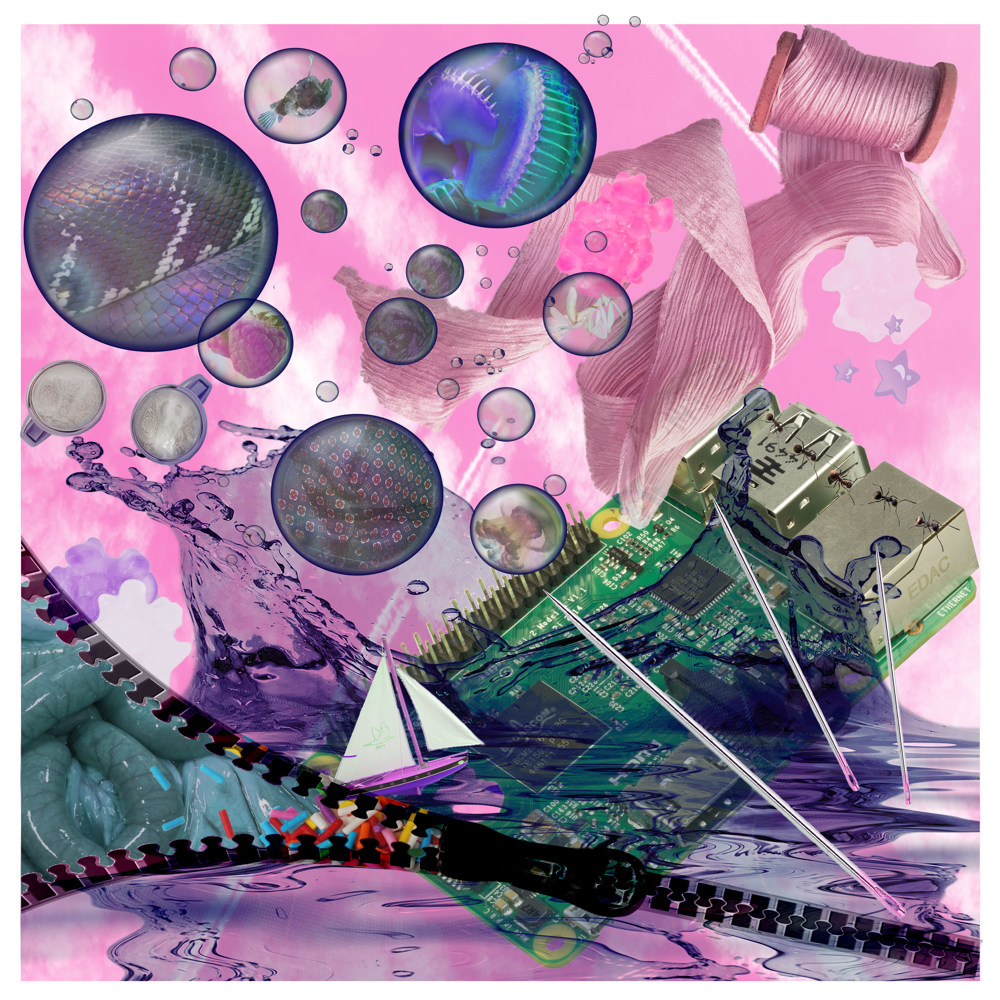

### Hello World, & Welcome to my Profile.

 

 

  
Hello, My name is Miles. I'm a Web Developer, designer, and artist. I love using code to solve problems, and also to create meaningful, unique, and/or silly art projects. I specalize in front end and UI.
When I'm not coding, my hobbies are photography, painting, watching anime, or playing video games.

  

**Quick Facts**

- 🌱 Learning React
- ⚡ Currently designing and coding art portfolios!
- ✨ Designed and released CROSSNIQ+ for the Nintendo Switch
- 💬 I Can Speak Mandarin
- 🏳️‍🌈 LGBTQ+

**Languages and Tools:**
Javascript
React
HTML/CSS
Java
Python